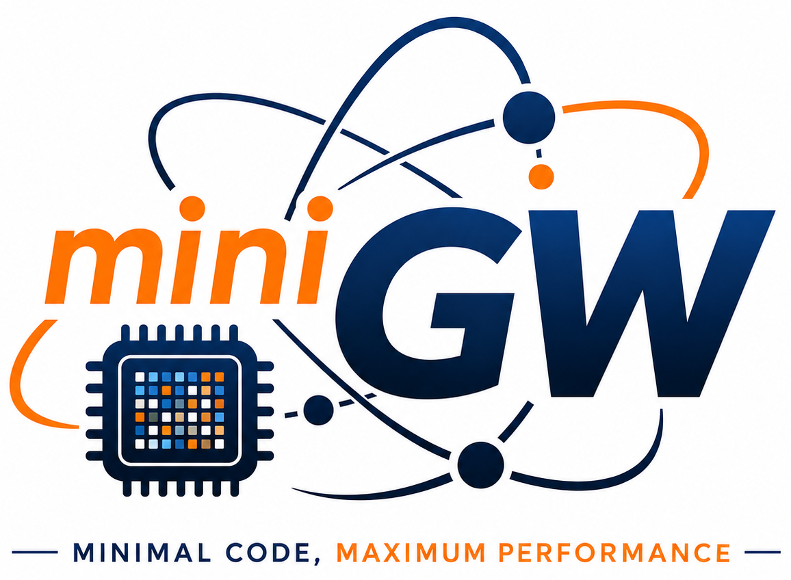

<p align="center">
  
</p>

# miniGW

A compact molecular G0W0 code written in modern C++20, using PySCF as the DFT starting point.

The project starts from a serial CPU implementation and a small self-contained `.npy` reader for importing PySCF-generated DFT data. The GW workflow calls dense linear algebra through `gw::linalg::Backend`, allowing BLAS/LAPACK, ScaLAPACK, COSMA, cuBLAS/cuSolver, or HIP backends to be added without rewriting the GW driver.

## Scope

Implemented modules:

- transformed Gauss-Legendre and linear frequency grids;
- particle-hole index mapping;
- bare exchange matrix in the MO basis;
- diagonal non-interacting polarizability in the particle-hole basis;
- particle-hole Coulomb matrix and projected `(p,q,ph)` tensor;
- correlation self-energy on the imaginary axis;
- continued-fraction Padé approximation;
- iterative diagonal quasiparticle-energy update;
- minimal NumPy `.npy` reader for little-endian `float64` arrays;
- explicit dense linear-algebra backend boundary with a serial reference backend.

## Build

```bash
cmake -S . -B build -C cmake_install.cmake
cmake --build build -j 4
```

## Expected input files

Run a pyscf DFT calculation (`pyscf_g0w0_prep.py` script from `pyscf_prep` directory) and its outputs contain:

```text
eri_mo.npy
mo_energy.npy
vxc_mo.npy
nocc.txt
fermi_energy.txt
```

The `.npy` reader currently supports C-order, little-endian `float64` arrays only.

## Run

```bash
./build/gw --input-dir /path/to/pyscf_output --freq-points 200 --pade-params 16 --state 5
```

Use `--all-states` to compute all diagonal states. 

## Regression Tests

```bash
ctest --test-dir build/ -N 
```

List all the cases to be tested.

```bash
ctest --test-dir build -j 4 --output-on-failure
```

Run all the regression test cases.


## Linear algebra backends

The default backend is `reference-serial`; it is intentionally simple and is meant for correctness and portability, not production performance. The current replacement boundary is documented in `docs/linalg_backend_interface.md`.

CMake exposes preparation switches for vendor libraries:

```bash
-DGW_ENABLE_BLAS_LAPACK=ON
-DGW_ENABLE_SCALAPACK=ON
-DGW_ENABLE_COSMA=ON
-DGW_ENABLE_CUDA=ON
```

These switches only prepare/link the relevant vendor targets when available. The actual optimized backend classes should be added as separate implementations of `gw::linalg::Backend`.

## Architecture notes

The current code separates four concerns that should remain independent as the project grows:

- **Execution policy** (`include/gw/execution.hpp`, `src/execution.cpp`) decides how frequency points and local kernels are scheduled: serial, OpenMP, or MPI frequency distribution.
- **Data ownership** (`include/gw/matrix/ownership.hpp`) records whether data are replicated host arrays, future device-resident arrays, or future distributed block-cyclic arrays.
- **Algorithm workspaces** (`include/gw/workspace/screening_workspace.hpp`, `src/workspace/screening_workspace.cpp`) own high-level GW temporaries such as `V_ph`, `inv(V_ph)`, `epsilon`, and `W_c`. The GW driver asks the workspace to compute `W_c` rather than directly managing all dense matrices.
- **Specialized backends** are selected by `include/gw/backend_factory.hpp` and `src/backend_factory.cpp`. The current production path is a replicated local-host backend (`reference`, optionally `blas-lapack`). ScaLAPACK, COSMA, and cuBLAS/cuSolver are intentionally kept behind explicit backend boundaries because real implementations require distributed or device-resident matrix ownership rather than the current replicated `MatrixComplex` interface.

Default builds use the reference backend and do not require MPI, OpenMP, or BLAS/LAPACK:

```bash
cmake -S . -B build -DCMAKE_BUILD_TYPE=Release -DGW_ENABLE_TESTS=OFF
cmake --build build -j
```

OpenMP kernel loops can be enabled with:

```bash
cmake -S . -B build-omp -DCMAKE_BUILD_TYPE=Release -DGW_ENABLE_TESTS=OFF -DGW_ENABLE_OPENMP=ON
cmake --build build-omp -j
```

MPI frequency distribution requires an MPI C++ toolchain:

```bash
cmake -S . -B build-mpi -DCMAKE_BUILD_TYPE=Release -DGW_ENABLE_TESTS=OFF -DGW_ENABLE_MPI=ON
cmake --build build-mpi -j
mpirun -np 4 ./build-mpi/gw --input-dir <input> --frequency-parallel mpi
```

## Vendor linear-algebra backend status

This version separates execution policy, data ownership, algorithm workspace, and backend families.  The default `reference` backend remains self-contained.  The optional vendor backends are intended for integration builds on systems where the corresponding HPC libraries are installed.

### BLAS/LAPACK

`--linalg-backend blas-lapack` uses CBLAS/LAPACKE for replicated host matrices:

- `cblas_zgemm` for dense complex GEMM,
- `cblas_zgemv` for dense complex GEMV,
- `LAPACKE_zgetrf` + `LAPACKE_zgetri` for the current inverse-based path.

Configure with, for example:

```bash
cmake -S . -B build-blas \
  -DCMAKE_BUILD_TYPE=Release \
  -DGW_ENABLE_BLAS_LAPACK=ON \
  -DBLA_VENDOR=OpenBLAS
```

### ScaLAPACK

`--linalg-backend scalapack` is now a real ScaLAPACK call path, but still behind the current replicated `MatrixComplex` interface.  It redistributes replicated host matrices to a 2-D BLACS block-cyclic layout, calls ScaLAPACK, and gathers the result back to every rank.  It uses:

- `pzgetrf` + `pzgetrs` to compute the inverse by solving against the identity,
- `pzgemm` for distributed GEMM.

This is useful for validating MPI/ScaLAPACK integration.  It is not yet the final production layout because the GW driver still materializes full `V_ph`, `pq_ph`, and `W_c` on each rank.

Configure with:

```bash
cmake -S . -B build-scalapack \
  -DCMAKE_BUILD_TYPE=Release \
  -DGW_ENABLE_MPI=ON \
  -DGW_ENABLE_SCALAPACK=ON \
  -DSCALAPACK_LIBRARIES="/path/to/libscalapack.so"
```

If `SCALAPACK_LIBRARIES` is omitted, CMake searches for a library named `scalapack`, `scalapack-openmpi`, or `scalapack-mpich`.

### COSMA

COSMA is a distributed GEMM engine, not a complete LAPACK replacement.  The current `cosma` backend keeps the correct semantic split: solve/factorization is delegated to the ScaLAPACK backend, and GEMM has a single replacement point in `src/linalg_cosma.cpp`.  At present the shipped implementation falls back to the ScaLAPACK GEMM path because COSMA's C++ API and installed target names differ across environments.  On a system with a known COSMA installation, replace `cosma_or_scalapack_gemm()` with the corresponding COSMA multiply call while keeping ScaLAPACK for solve/factorization.

Configure with:

```bash
cmake -S . -B build-cosma \
  -DCMAKE_BUILD_TYPE=Release \
  -DGW_ENABLE_MPI=ON \
  -DGW_ENABLE_SCALAPACK=ON \
  -DGW_ENABLE_COSMA=ON
```

### cuBLAS/cuSolver

`--linalg-backend cublas` is now a real single-rank CUDA call path using host-wrapper semantics:

- `cublasZgemm` for GEMM,
- `cublasZgemv` for GEMV,
- `cusolverDnZgetrf` + `cusolverDnZgetrs` for inverse-by-solve.

Inputs and outputs are still replicated host `MatrixComplex` objects.  Each call copies data to the device, performs the operation, and copies the result back.  This is suitable for correctness and incremental integration, but not yet the high-performance design.  The high-performance design should keep `V_ph`, `epsilon`, solver workspaces, and contraction buffers device-resident across frequency points.

Configure with:

```bash
cmake -S . -B build-cuda \
  -DCMAKE_BUILD_TYPE=Release \
  -DGW_ENABLE_CUDA=ON
```

## ScaLAPACK distributed screening path

The ScaLAPACK backend now has two layers:

1. A legacy replicated-wrapper backend (`--linalg-backend scalapack`) for generic
   `gw::linalg::Backend` calls. It redistributes a replicated host matrix to a
   BLACS 2-D block-cyclic matrix, calls ScaLAPACK, and gathers the result.
2. A GW-specific distributed screening path used by `run_g0w0()` when the
   selected backend has distributed-MPI capabilities. In this path `V_ph`,
   `epsilon`, `inv(V_ph)`, and `W_c` are owned as `DistributedMatrixComplex`
   block-cyclic matrices inside `DistributedScreeningWorkspace`. The self-energy
   contraction evaluates `p^T W_c p` by summing local `W_c` blocks and reducing
   the scalar, so `W_c` is not gathered during the frequency loop.

Build example:

```bash
cmake -S . -B build-scalapack \
  -DCMAKE_BUILD_TYPE=Release \
  -DGW_ENABLE_MPI=ON \
  -DGW_ENABLE_SCALAPACK=ON \
  -DSCALAPACK_LIBRARIES="/path/to/libscalapack.so"
cmake --build build-scalapack -j
```

Run examples:

All ranks cooperate on every frequency point:

```bash
mpirun -np 4 ./build-scalapack/gw \
  --input-dir regression_tests/h2o_serial \
  --frequency-parallel serial \
  --linalg-backend scalapack
```

Frequency batching with ScaLAPACK communicator groups:

```bash
mpirun -np 16 ./build-scalapack/gw \
  --input-dir regression_tests/h2o_serial \
  --frequency-parallel mpi \
  --scalapack-ranks-per-group 4 \
  --linalg-backend scalapack
```

In the second mode, `MPI_COMM_WORLD` is split into independent frequency groups.
Each group owns a BLACS/ScaLAPACK grid and collectively processes one frequency
point at a time; different groups process different frequency indices.  The
default is `--scalapack-ranks-per-group 4`.

Remaining limitation: ERI and `pq_ph` are still replicated. The current step
removes replicated ownership of the dominant `n_ph x n_ph` screening matrices;
full distributed-memory GW still requires a distributed/tiled integral and
self-energy contraction design.

## Distributed panel contraction update

The ScaLAPACK screening path now applies the screened interaction to a panel of
particle-hole vectors as a distributed matrix multiplication.  For a panel
`X = [x_1, ..., x_m]` with shape `n_ph x m`, the distributed path computes

```text
Y = W_c X
q_j = x_j^T y_j
```

where `W_c`, `X`, and `Y` are represented as BLACS block-cyclic distributed
matrices during the multiplication.  Only the final vector of scalar quadratic
forms is reduced across MPI ranks.  The current implementation still assembles
`X` from the replicated `pq_ph` tensor; the main `n_ph x n_ph` application is now
performed by ScaLAPACK `pzgemm` rather than by a hand-written local block loop.

## Current architecture note: panel-based `pq_ph` contraction

The self-energy contraction no longer materializes the full
`pq_ph(nmo, nmo, n_ph)` tensor in the main GW workflow.  Instead, `gw::workspace::PqPhPanelView`
generates panels on demand from the current `MolecularIntegrals` view:

```text
X = [pq_ph(p,k0,:), pq_ph(p,k0+1,:), ...]
```

The local path applies the screened interaction as `Y = W_c X` with the selected
local linear-algebra backend.  The ScaLAPACK path scatters this panel into a
block-cyclic distributed matrix and computes `Y = W_c X` with distributed GEMM.
This removes the resident `O(nmo^2 n_ph)` `pq_ph` allocation, but the ERI tensor
itself is still replicated in the current implementation.

The COSMA integration point is now the distributed GEMM provider used by
`DistributedMatrixComplex::distributed_gemm`.  By default, the COSMA provider
falls back to ScaLAPACK `PZGEMM`; on a system with a known COSMA CMake target and
C++ API, replace the marked branch in `src/matrix/distributed_matrix.cpp` with
the corresponding COSMA multiply call.  ScaLAPACK remains responsible for
factorization/solve.

## CUDA/HIP device-resident screening path

When configured with `-DGW_ENABLE_CUDA=ON` and run with `--linalg-backend cublas`, miniGW uses a dedicated `DeviceScreeningWorkspace` for the screening part of the GW calculation.  When configured with `-DGW_ENABLE_HIP=ON` and run with `--linalg-backend hipblas`, the analogous HIP/ROCm path uses `HipScreeningWorkspace`.  This is different from the lower-level host-wrapper backends: `V_ph`, `inv(V_ph)`, `epsilon`, `inv(epsilon)-I`, `W_c`, the solver LU workspace, and contraction panel buffers are allocated once and reused on the GPU.

Serial frequency execution is supported for single-rank runs:

```bash
./gw --linalg-backend cublas --frequency-parallel serial
./gw --linalg-backend hipblas --frequency-parallel serial
```

MPI frequency distribution is supported for both CUDA and HIP/ROCm device-resident paths.  Use `--tasks-per-gpu N` to control how many MPI ranks on the same node share one visible GPU device; the default is 4.  The mapping is local-rank based: `device = (local_rank / tasks_per_gpu) % visible_device_count`.

CUDA example:

```bash
mpirun -np 8 ./gw --linalg-backend cublas --frequency-parallel mpi --tasks-per-gpu 4
```

HIP/ROCm example:

```bash
mpirun -np 8 ./gw --linalg-backend hipblas --frequency-parallel mpi --tasks-per-gpu 4
```

The input ERI tensor is still replicated in host memory.  The CUDA and HIP/ROCm paths no longer materialize a full `pq_ph` tensor; contraction panels are supplied by the corresponding device panel view, which either assembles them from a full device ERI copy or streams them through pinned host staging when the full ERI would be too large for the GPU.

### CUDA pq-panel source: resident ERI or streaming panels

The CUDA path now has two device-oriented workspaces:

- `DeviceScreeningWorkspace`, which keeps `V_ph`, `inv(V_ph)`, `epsilon`, `inv(epsilon)-I`, `W_c`, cuBLAS/cuSolver handles, and solver work buffers on the GPU.
- `DevicePqPhPanelView`, which provides device-resident contraction panels `X(ph,k)` to the screening workspace.

`DevicePqPhPanelView` now supports two storage strategies. In `full-eri-resident` mode it uploads the full replicated ERI tensor to the GPU and assembles each panel with a CUDA kernel. In `streaming-panel` mode it leaves ERI on the host, assembles only the requested `n_ph x panel_width` slice in a pinned host staging buffer, and copies that panel to the GPU. The default `auto` mode chooses full ERI residency only when the ERI copy fits a conservative fraction of currently available device memory; otherwise it uses streaming panels.

This is the dense single-GPU endpoint of the current architecture: the screening matrices stay device-resident, and the `pq_ph` panel path no longer requires full `pq_ph(nmo,nmo,n_ph)` materialization or mandatory full ERI residency on the GPU. A production-scale implementation would still need true integral tiling/shell-block streaming or an RI/three-center representation instead of a replicated four-index ERI tensor.


### HIP/ROCm backend

AMD GPU support is available through a separate HIP/ROCm backend.  It mirrors the CUDA device-resident screening path but uses HIP runtime, hipBLAS, and hipSOLVER.  Build it with:

```bash
cmake -S . -B build-hip \
  -DCMAKE_BUILD_TYPE=Release \
  -DGW_ENABLE_TESTS=OFF \
  -DGW_ENABLE_HIP=ON
cmake --build build-hip -j
```

Run it with:

```bash
./build-hip/gw \
  --input-dir regression_tests/h2o_serial \
  --linalg-backend hipblas \
  --frequency-parallel serial \
  --contraction-panel-size 32
```

The HIP path is single-rank and device-resident, like the CUDA path.  It keeps `V_ph`, `epsilon`, `inv(V_ph)`, `W_c`, and contraction buffers on the AMD GPU.  The `pq` panel source supports full-ERI-resident and streaming-panel modes.


Note on ScaLAPACK frequency groups: with `--frequency-parallel mpi`, only the root rank of each ScaLAPACK communicator group contributes its completed frequency columns to the final world-level reduction. Non-root ranks in the same group participate in all ScaLAPACK collectives but keep their replicated output columns zero before the final `MPI_Allreduce`, avoiding over-counting by the group size.

Progress output for grouped ScaLAPACK runs is reported per frequency group.  The
`completed A / B assigned distributed frequencies` counter is local to the group;
the parenthesized `last global frequency` field shows the 1-based global frequency
index most recently completed by that group.  This avoids the misleading pattern
where only one group appeared to print progress when global frequency numbers were
reported every tenth point.
